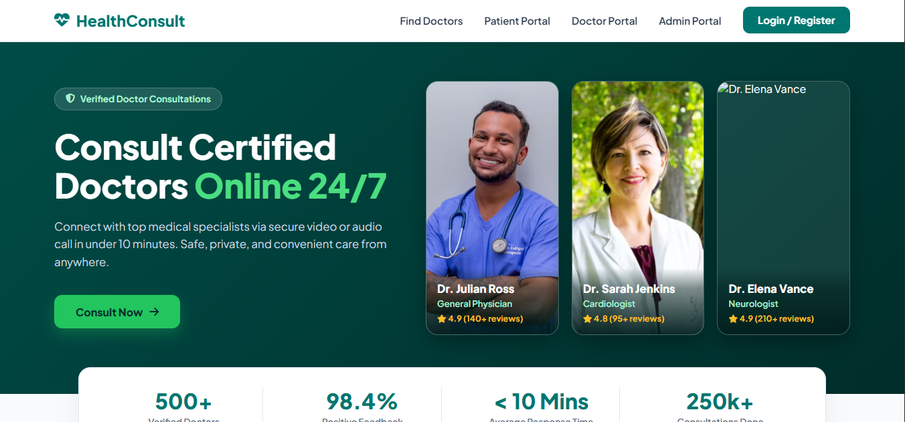
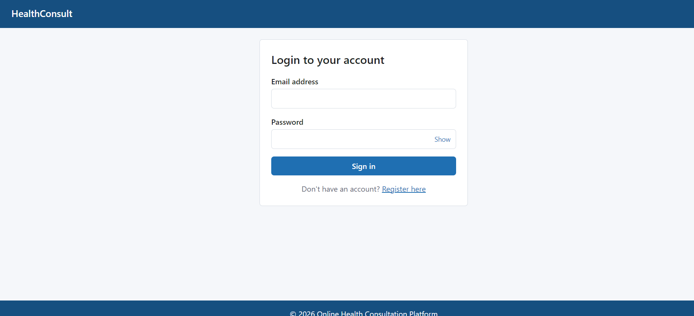
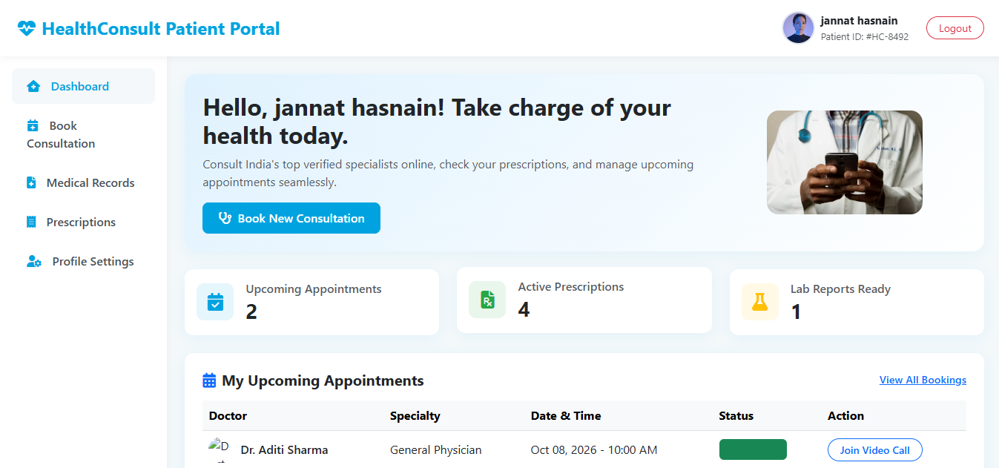
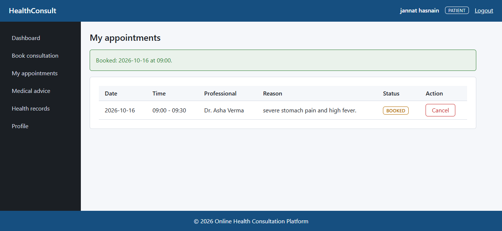
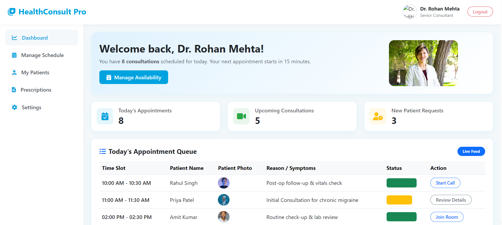
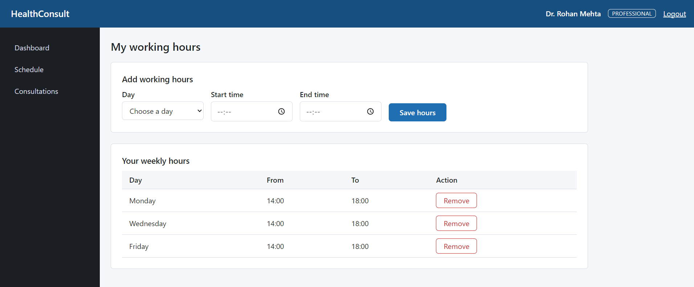

# 🩺 Online Health Consultation Platform


**Online Health Consultation Platform** is not just another booking form — it is a **role-based healthcare consultation system**.  
From finding a professional to booking a safe, conflict-free slot, it helps patients get care without phone calls or waiting,  
and gives professionals and administrators the tools to run their day.

Whether you're a patient looking for a quick appointment or a clinic that wants an organised schedule,  
the platform acts like a **digital front desk, scheduler, and record keeper — all in one place.**

---

## 🚀 Key Highlights

- ⚡ End-to-end appointment booking for patients, professionals and admins  
- 🔒 Role-based access enforced on the server for every page  
- 🧾 Transaction-safe booking: no two people can hold the same slot  
- ⏰ Background reminder thread for upcoming appointments  
- 🛡️ BCrypt password hashing, prepared statements, escaped output  

---

## 📌 What Problem Does It Solve?

Most patients don't know:

- Which professionals are available and when  
- Whether the slot they want is really free  
- How to cancel without calling the clinic  
- What happens next after booking  

The platform bridges this gap by turning a phone-call process into **a clear, instant, self-service booking flow**.

---

## 💡 Why Online Health Consultation Platform?

Most appointment tools either show a calendar *or* store records — but rarely protect against double-booking and enforce who can see what.

This platform covers the **whole consultation loop**:

- 👤 Register and log in securely (Authentication)  
- 📅 Choose a professional, date and free slot (Booking)  
- 🧑‍⚕️ Manage working hours (Professional Schedule)  
- ⏰ Get reminded before the visit (Reminder Thread)  
- 🛠️ Oversee the platform (Admin Dashboard)  

It's not just a form — it's a **reliable appointment system with rules built in**.

---

## ✨ Core Features

### 👤 Authentication & Access
- Patient registration and login  
- Session renewed at login, 30-minute timeout  
- Role-based access: Patient, Professional, Admin  
- Friendly 403, 404 and 500 pages  

### 📅 Appointment Booking
- Choose professional, date and a free slot  
- Reason for visit is required and validated  
- Booking is one database transaction with row locking  
- Unique key on live slots as a final safety net  

### 📋 My Appointments
- Upcoming and past appointments  
- Cancel before the cut-off time  
- Cancelled slots become available again  

### 🧑‍⚕️ Professional Schedule
- Set weekly working hours  
- Overlapping or invalid hours are rejected  
- Dashboard for the day's consultations  

### ⏰ Reminder Thread
- Runs in the background every minute  
- Logs a reminder for appointments starting within the hour  
- Stops cleanly when the application stops  

### 🛠️ Admin Dashboard
- Overview of platform activity  

### 🚧 Coming Soon
- Medical advice and prescriptions  
- Health records  
- Profile management  
- Messaging between patient and professional  
- User management, settings and analytics for admins  

---

## 🧠 System Architecture

The platform follows a **layered Servlet/JSP architecture**:

### 🔹 Frontend (JSP + JSTL)
- Pages live in `WEB-INF/views`, reachable only through a servlet  
- Shared header, sidebar and footer  
- Post-Redirect-Get with one-time flash messages  

### 🔹 Controllers (Servlets)
- Read the request and validate input  
- Call a service, then redirect  
- Never contain SQL  

### 🔹 Business Layer (Services)
- Booking rules and slot calculation  
- Transactions through `DBUtil.inTransaction`  
- Reminder logic  

### 🔹 Data Layer (DAO + JDBC)
- All SQL in one place  
- `PreparedStatement` for every query  

### 🔹 Filters
- `AuthFilter` → login check  
- `RoleFilter` → role check by URL prefix (`/admin/`, `/pro/`, `/patient/`)  

### 🔹 Database (MySQL)
- Users and role profiles  
- Availability, appointments, consultations  
- Health records, messages, settings, activity log  

### 🔹 Authentication
- BCrypt password hashing  
- Server-side session  

**Flow:**  
Browser → Filters → Servlet → Service → DAO → MySQL → JSP view

---

## 🛠️ Tech Stack

- **Language:** Java 17  
- **Web:** Jakarta Servlet 6, JSP, JSTL  
- **Database:** MySQL 8, JDBC  
- **Server:** Apache Tomcat 10.1  
- **Build:** Maven  
- **Auth:** BCrypt (jBCrypt)  
- **Testing:** JUnit 5, Mockito  
- **CI:** GitHub Actions  

---

## ⚙️ Installation

You need JDK 17, Maven 3.9+, MySQL 8, Tomcat 10.1 (not 9) and Git.

### 1. Clone the Repository
```bash
git clone https://github.com/Ankit-8081/Health-Consultation-Platform.git
cd Health-Consultation-Platform
```

### 2. Database Setup
```bash
mysql -u root -p < docs/schema.sql
mysql -u root -p healthdb < docs/seed.sql
```

### 3. Environment Variables
Copy the example file and fill in your MySQL login:
```bash
cp src/main/resources/db.properties.example src/main/resources/db.properties
```
```properties
db.url=jdbc:mysql://localhost:3306/healthdb?useSSL=false&allowPublicKeyRetrieval=true&serverTimezone=Asia/Kolkata
db.user=root
db.password=your_password
```
This file is git-ignored, so your password stays on your machine.

### 4. Build and Test
```bash
mvn clean package
```
This runs the tests (no database needed) and creates `target/health-consult.war`.

### 5. Run on Tomcat
Copy `target/health-consult.war` into Tomcat's `webapps/` folder, start Tomcat, and open:

**http://localhost:8080/health-consult/**

---

## 🚀 Usage

- Open the site and choose Login / Register  
- Register as a patient (or use a demo account)  
- Open Book consultation and choose a professional, date and slot  
- Check My appointments, and cancel if needed  
- Log in as a professional and set your hours under Schedule  

### Demo accounts
Password for all: `Password@123`

| Role | Email |
|---|---|
| Patient | `priya@health.example` |
| Professional | `asha@health.example` |
| Admin | `admin@health.example` |

---

## 📸 Demo / Screenshots

### 🏠 Landing Page


### 🔐 Login


### 📊 Patient Dashboard


### 📅 Book Consultation


### 📋 My Appointments


### 🧑‍⚕️ Professional Dashboard


### 🗓️ Professional Schedule


---

## 📁 Project Structure

```bash
/Health-Consultation-Platform
│
├── docs/
│   ├── diagrams/
│   ├── SRS.md
│   ├── UI_Handoff_Spec.md
│   ├── schema.sql
│   └── seed.sql
│
├── src/
│   ├── main/
│   │   ├── java/com/healthconsult/
│   │   │   ├── dao/
│   │   │   ├── exception/
│   │   │   ├── filter/
│   │   │   ├── model/
│   │   │   ├── service/
│   │   │   ├── servlet/
│   │   │   ├── thread/
│   │   │   └── util/
│   │   ├── resources/
│   │   └── webapp/
│   │       ├── WEB-INF/
│   │       ├── css/
│   │       └── js/
│   └── test/java/
│
├── .github/workflows/ci.yml
├── .gitignore
├── LICENSE
├── pom.xml
└── README.md
```

---

## 📊 Future Improvements

- Medical advice, prescriptions and follow-up dates  
- Patient health records  
- Real-time messaging between patient and professional  
- Admin analytics and system settings  
- Printable consultation summary  
- Email or SMS reminders  
- Docker setup and automated deployment  

---

## 🤝 Contributing

Contributions are welcome. Fork the repository and open a pull request. Run `mvn clean package` before you submit.

---

## 📄 License

This project is licensed under the **MIT License**.  
You are free to use, modify, and distribute this software with proper attribution.

---

## 👤 Team

- **Ankit Raj** – Backend,Architecture and Integration  
- **Aditya** – Authentication and Booking  
- **Jannat** – Frontend Development, UI/UX  
- **Monal** – DevOps, Testing and CI  
